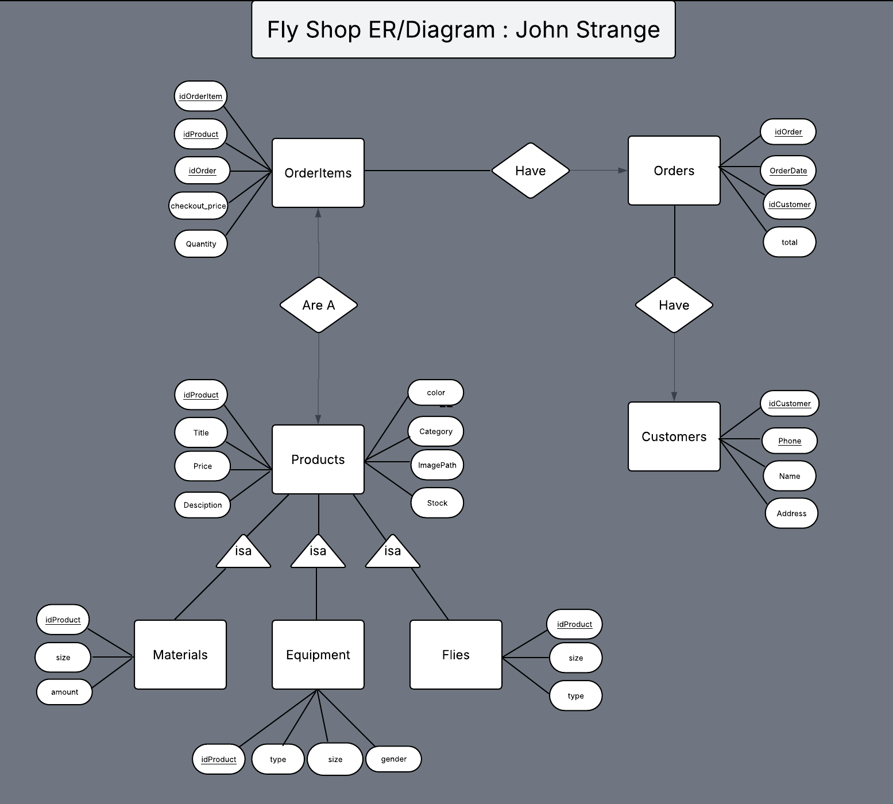

# CS495 Final Project – Fly Shop Website

## Overview
This is a simple e-commerce web application developed for **CS495 – Special Topics in Database Systems**.  
The application shows a full-stack design with a focus on relational database modeling and data management.

---

## Features
- Browse products by category
- View Product Details  
- Search products by name  
- Admin page with reporting and Data consistency tools
- Client-side cart functionality that inserts orders on checkout

---

## Tech Stack
- **Frontend:** HTML, CSS, Bootstrap, JavaScript, Chart.js
- **Backend:** Node.js, Express, mysql2
- **Database:** MySQL  

---

## Database Design
- Products  
- Flies, Equipment, Materials (subtables of Products)  
- Customers  
- Orders  
- OrderItems  

## ERDiagram

### Key Considerations
- Each product exists in the `Products` table, with subtype tables storing category-specific data  
- Each customer can have multiple orders  
- Each order can contain multiple order items  

---

## Setup Instructions

### 1. Initialize the Database
Optionally run the AIO.sql script that includes everything

```bash
/DB/AIO.sql
```
Or Run them seperately in order

```bash
* initialization.sql
* testData.sql
* productSalesQuarter.sql
* salesReporting.sql
* idProduct.sql
* orderDate.sql
```
### 3. Change dbconfig to match your credentials
```bash
    module.exports = {
        host: 'localhost',
        user: 'YOUR_USERNAME',
        password: 'YOUR_PASSWORD',
        database: 'YOUR_DBNAME'
    };
```
### 4. Install Dependencies
Make sure Node.js and npm are installed, then run this command on the API Server project and the UI project.

```bash
npm install
```

### 5. Start the Application
In one terminal start the server by running the command:
```bash
node .\Routes\server.js
```
then while in the UI project run this command:
```bash
npm run dev
```
---

## Author
John Strange  
Northern Michigan University